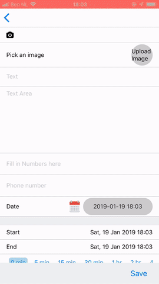
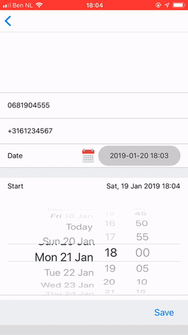
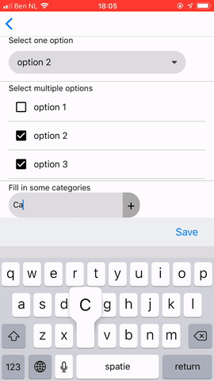

# React Native Data Forms

Create beautiful forms that submit data to redux, a graphql mutation, or an api in many different input types

React-native-data-forms is an opinionated yet very flexible library that makes data from any source editable using react native components. The data can be of many different types. If you have an app with many data properties that need to be edited, this can be a huge boilerplate reducer! For me it was, at least. When I introduced it it instantly removed >1000 LOC in my codebase. Then, I doubled the amount of pages with only a few dozen LOC added. Without this component that would be thousands of LOC.

This component is built for mutations of React Apollo GraphQL, but it can potentially also be used together with local databases, redux, or even state!

The goal of this function is to seperate semantics from data from implementation of showing editable and savable database data from any mutation, where data can have any type.

## Documentation

## Example Use

**Step 1:** Create a wrapper of our component:

If you want to use our data-types:

```js
import * as React from "react";
import expo from "expo";

import _DataForm from "react-native-data-forms";
import { Field } from "react-native-data-forms/types";

// Optional: import extra input types, for example an emailsOrUsersInput type you created yourself that takes a text and suggests an email or users from your userbase.
import emailsOrUsers from "./fat/emailsOrUsersInput";

// Optional: if you want to use image upload (image and coverImage), give a firebase Config here.
const firebaseConfig = {
  apiKey: "?????",
  authDomain: "?????",
  databaseURL: "?????",
  projectId: "??????",
  storageBucket: "?????",
  messagingSenderId: "?????"
};

// Optional: if you want to use the location input type, we need a google places key.
const googlePlacesConfig = {
  key: "?????"
};

// Create and export DataForms with default props installed.
const DataForm = props => {
  const allProps = {
    ...props,
    expo,
    firebaseConfig,
    googlePlacesConfig,
    extraInputTypes: { emailsOrUsers }
  };
  return <_DataForm {...allProps} />;
};

export { DataForm };
```

If you will import your own data-types and don't use ours:

```js
import * as React from "react";
import _DataForm from "react-native-data-forms";
import { Field } from "react-native-data-forms/types";

// Import extra input types
import emailsOrUsers from "./fat/emailsOrUsersInput";

const DataForm = props => {
  return <_DataForm {...props} extraInputTypes={{ emailsOrUsers }} />;
};
export { DataForm };
```

**Step 2:**
This library has a few peer dependencies you need to have installed in order to use all input types. Feel free no to install the ones of the input types you don't use.

- For most: `yarn add react-native-vector-icons` (Or use @expo/vector-icons)
- For `date`: `yarn add react-native-date-picker`
- For `location`: `yarn add react-native-google-places-autocomplete`
- For `selectOne`: `yarn add react-native-modal-selector`
- For `image` or `cover-image`: `yarn add react-native-super-image`

**Step 3:** if you need the `location` or `image` type, you need to add the data-forms screens to your navigation stack where you want the image-screen and location-screen to load, like so:

```js
import { screens } from "react-native-data-forms";

const Stack = createStackNavigator({
  root: { screen: HomeScreen },
  ...screens
});
```

You're all set up! You can use the component like this: This is an example with all default types, getting data from a GraphQL query, sending it to a GraphQL mutation:

```js
import * as React from "react";
import gql from "graphql-tag";
import { compose, graphql } from "react-apollo";
import { DataForm } from "../import";
import { Field } from "react-native-data-forms/types";
import { Alert } from "react-native";

class Example extends React.Component {
  render() {
    const { data, mutate } = this.props;

    const defaultComplete = () => Alert.alert("Saved");

    const fields: Field[] = [
      { field: "coverImage", type: "coverImage" },
      { field: "image", type: "image", title: "Pick an image" },
      { field: "text", title: "Text" }, //default type is a text input
      { field: "textArea", title: "Text Area", type: "textArea" },
      { field: "numbers", title: "Fill in Numbers here", type: "numbers" },
      { field: "phone", title: "Phone number", type: "phone" },
      { field: "date", title: "Date", type: "date" },
      {
        field: "STARTEND",
        titles: {
          start: "Start",
          end: "End"
        },
        mapFieldsToDB: {
          start: "eventAt",
          end: "eventEndAt"
        },
        startSection: true,
        type: "dates"
      },

      {
        startSection: true,
        field: "color",
        title: "Color",
        type: "color"
      },

      { field: "boolean", title: "Boolean type", type: "boolean" },

      {
        startSection: true,
        field: "LOCATION",
        mapFieldsToDB: {
          address: "address",
          city: "city",
          mapsurl: "mapsurl",
          country: "country",
          latitude: "latitude",
          longitude: "longitude"
        },
        title: "Location",
        type: "location"
      },

      {
        field: "selectOne",
        title: "Select one option",
        type: "selectOne",
        values: [
          { value: 1, label: "option 1" },
          { value: 2, label: "option 2" },
          { value: 3, label: "option 3" }
        ]
      },

      {
        field: "selectMultiple",
        title: "Select multiple options",
        type: "selectMultiple",
        values: ["option 1 ", "option 2 ", "option 3"]
      },

      {
        field: "categories",
        title: "Fill in some categories",
        type: "categories"
      },

      { field: "dictionary", title: "Dictionary", type: "dictionary" }
    ];

    return (
      <DataForm
        {...this.props}
        fields={fields}
        onComplete={defaultComplete}
        mutate={vars => mutate(vars)}
        values={data.example}
      />
    );
  }
}

const query = gql`
  query Example {
    example {
      coverImage
      image
      text
      textArea
      numbers
      phone
      date
      color
      boolean
      selectOne
      selectMultiple
      categories
      dictionary
      eventAt
    }
  }
`;

const mutation = gql`
  mutation ExampleMutation(
    $coverImage: String
    $image: String
    $text: String
    $textArea: String
    $numbers: Int
    $phone: String
    $date: Date
    $color: String
    $boolean: Boolean
    $selectOne: String
    $selectMultiple: String
    $categories: String
    $dictionary: String
    $eventAt: Date
  ) {
    exampleMutation(
      coverImage: $coverImage
      image: $image
      text: $text
      textArea: $textArea
      numbers: $numbers
      phone: $phone
      date: $date
      color: $color
      boolean: $boolean
      selectOne: $selectOne
      selectMultiple: $selectMultiple
      categories: $categories
      dictionary: $dictionary
      eventAt: $eventAt
    )
  }
`;

export default compose(
  graphql(query),
  graphql(mutation)
)(Example);
```

This will look like this:





### Props

[See types-file](/types.tsx)

## Expanding

In the future, I'm planning to add these features to the codebase.

- Single Sign On with Google, Facebook, LinkedIn...
- Passwords
- Style properties
- Selecting and uploading multiple images/videos, 1 by 1
- File upload
- Step-by-step form functionality that walks through all inputs one by one, navigating to the next input using a stack navigator. This can be achieved by adding a walkThrough bool prop and a function getScreens that returns all Forms seperately in screens-objects which can be added to your stack-navigator dynamically.

If you want, you can create PR's for this:

- Wix navigation support
- bare react-native support

If anyone using this likes to contribute, please contact me so we can discuss about the way to implement things. [Here](https://karsens.com) you can find a contact button.

## How to add my own input types?

Coming soon. For now, have a look [here](./inputs) how we do it.

## F.A.Q.

**Our codebase is way to complex for something as magical as this, isn't it?**

We strive to make this work for almost anything. You can hide/show fields based on other data, you can validate values and show error messages, and you can add your own custom input type components. There are many props you can additionally add to a field, see [types](./types.tsx)

**What's the advantage of this library if I just use my own components?**

Seperating data-flow from UI/UX, mostly.

**Is this library well maintained?**

Yes, I maintain it ([see my profile](https://karsens.com)) because I use it myself for [Communify](https://communify.cc) and other apps, contact me if you have any questions.

**What's the difference betweeen this and redux-forms?**

Redux forms only works with redux state. This also works with API's, Apollo mutations, and even normal state. Anything.

Besides that, this is a single component in which you can add your own field-types if you need them. This component builds a form based on a fields-object. This fields-object is much much smaller then adding all field-types independently (for example if you use Redux-Forms). See the Example!

**So you support submitting to an API? How?**

The prop `mutate` is a function that based on all filled in values has to return a Promise which fulfills with the result. This can be an API post, a Redux Dispatch, or an Apollo Mutation. The prop `values` should contain all field-values, and can be obtained directly from Apollo Data, from an API fetch, or from a (Redux) state.

## Hire me


If you need consulting about whether or not it's possible to use this in your codebase - contact me - I'll advise you for free. If you need help to convert your codebase to use this library, I can help you with that. [Hire me](https://karsens.com/hire-me/).
